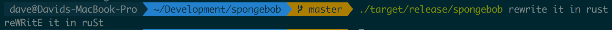

# sPongEbob ClI
A rewrite of [supersimple's](https://github.com/supersimple) [Spongebob CLI](https://github.com/supersimple/spongebob) in Rust

## Why?
The other version is written in Go, which is fast, but not ⚡ fast.



## Install
1. [Install Rust](https://www.rust-lang.org/tools/install)
2. `cargo build --release`
3. `cp ./target/release/spongebob /somewhere/in/your/path`

## Usage

``` bash
$ spongebob --help
spongebob 1.0
Dave Lucia <davelucianyc@gmail.com>
SPongEbOB IS BuiLT WiTH lOve foR aLl YOuR SarCAsTIc NEEds

USAGE:
    spongebob [OPTIONS] [input]...

ARGS:
    <input>...    SAy WhAT nEEDs tO BE saId

FLAGS:
    -h, --help       Prints help information
    -V, --version    Prints version information

OPTIONS:
    -s, --style <style>    quiet, loud or normal
```

## Install on Arch

If you're running on Arch Linux you can install the package by building with the included `PKGBUILD`.

```bash
# Build the package
makepkg

# Install the resulting package file
sudo pacman -U spongebob-0.1.0-1-x86_64.pkg.tar.zst
```

## Install using Snap

```bash
snap install --edge spongebob
```